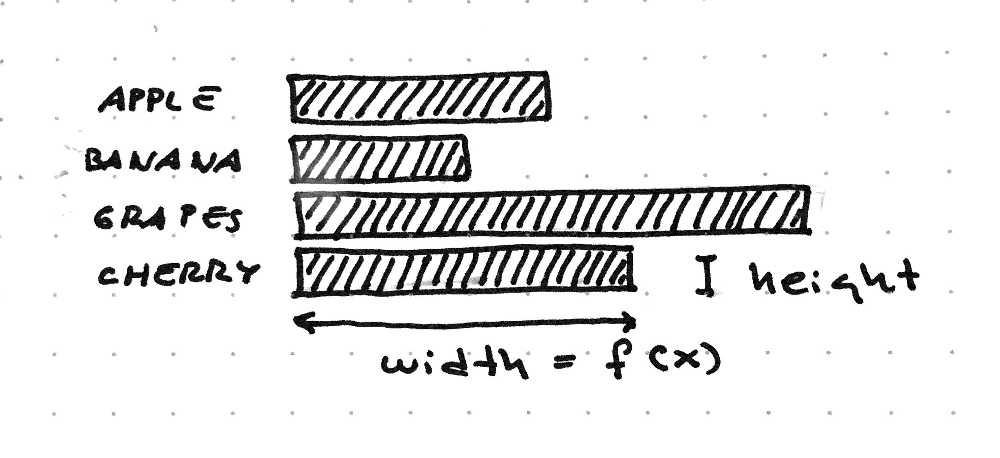
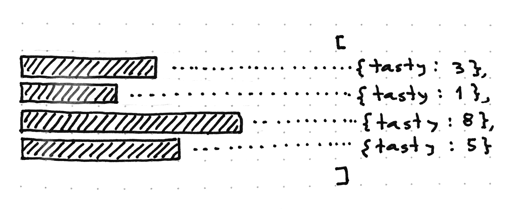
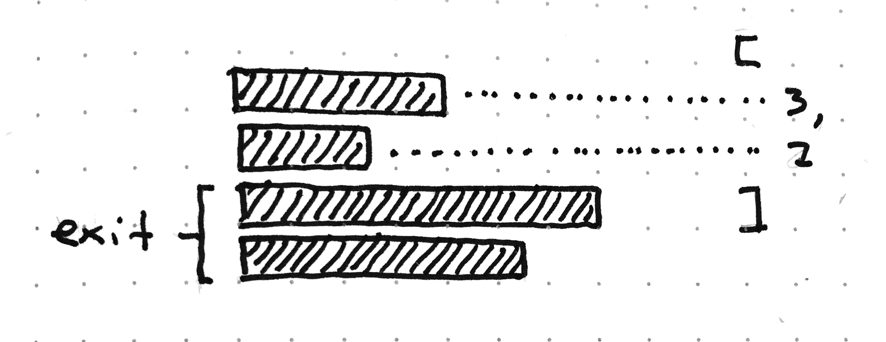

# Creating Reusable Charts with D3

## What is a Chart?

A chart is a _mapping_ between data attributes and visual attributes of objects representing the data items. The data attributes are encoded using position, colour, size or shape of the visual elements.

[xkcd: Tastiness of Fruits](https://xkcd.com/388/)

Bar charts, for instance, use rectangles to represent the data items, encoding one quantitative dimension in the length of one of the sides of the rectangle

In most charting software and utils, we are given a set of charts (bar chart, scatter plot) and we need to provide the data to create the items. With D3, we create charts by manipulating the mapping between data attributes and attributes (and styles) of DOM elements.

## Introduction to D3 (Data Driven Documents)

[D3.js](http://www.d3js.org) is a JavaScript library to bind data elements to documents (DOM elements) and manipulate attributes of the documents based in the data bound to it.

Binding data items to DOM elements allows us to manipulate their attributes, in this case, the div width and content. The color, margin and borders are set using CSS:

<a class="jsbin-embed" href="http://jsbin.com/wefila/latest/embed?js,output">Data Binding</a>

D3 also includes a number of utility functions to help us creating charts. Here we will use a [linear scale](https://github.com/mbostock/d3/wiki/Quantitative-Scales#linear-scales) to compute the mapping between the tastiness of the fruit to pixels in the screen.

<a class="jsbin-embed" href="http://jsbin.com/gepuvi/latest/embed?html,js&height=600px">JS Bin</a>

## The Selection Lifecycle: Enter, Update and Exit

In the previous examples, we already had 4 div elements, and we also had exactly 4 elements in the array to bind to the divs. What happens if we don’t have enough DOM elements, or if we have too many?

D3 creates special selections, that allow us to create, remove and update the elements in each case. We need to specify what will happen in every step of the element’s life cycle.

### Exit Selection (Removing)

If there are more DOM elements that data items, the remaining DOM elements will be stored in the [exit selection](https://github.com/mbostock/d3/wiki/Selections#exit). These elements can be manipulated in the same way that regular selections, except that they don’t have bound data items.

<a class="jsbin-embed" href="http://jsbin.com/wilaja/latest/embed?html,js&height=700px">JS Bin</a>

### Enter Selection

If there are less (or none) DOM elements than data items, the [enter selection](https://github.com/mbostock/d3/wiki/Selections#enter) will contain _placeholder_ DOM elements to create the mapping. Before manipulating the element attributes, we need to create the _actual_ DOM elements first by using the [append](https://github.com/mbostock/d3/wiki/Selections#append) method

<a class="jsbin-embed" href="http://jsbin.com/tosubi/latest/embed?js,output&height=700px">JS Bin</a>

Before starting to create a more generic bar chart, we will simplify our code a bit

<a class="jsbin-embed" href="http://jsbin.com/canawi/latest/embed?html,js&height=900px">Simplifying</a>

[Next](/charting-function.html)
